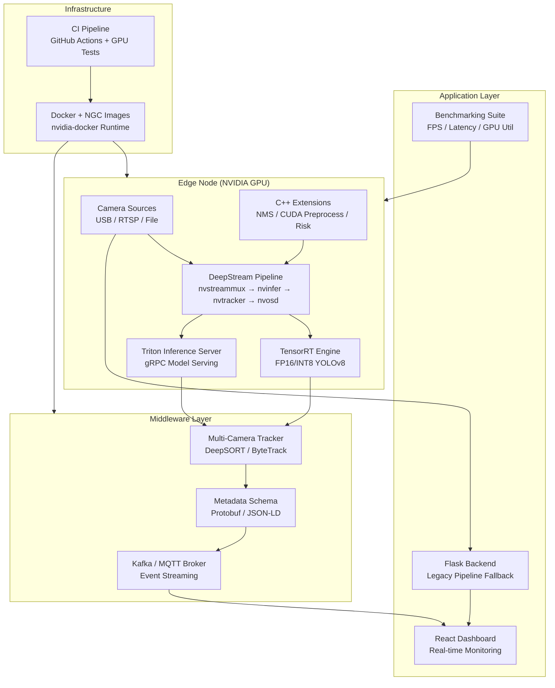
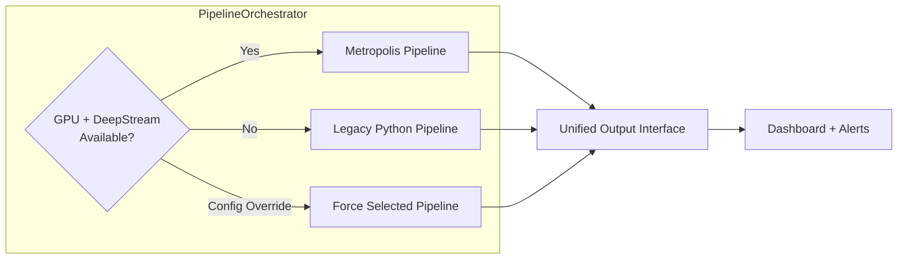
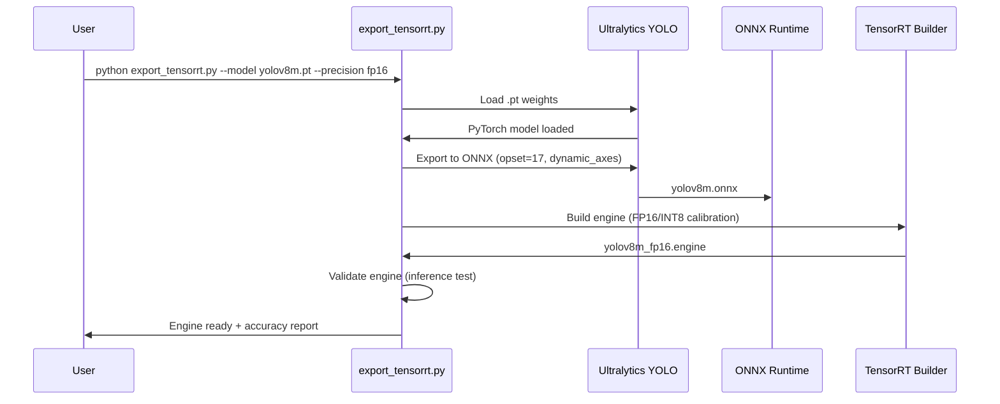
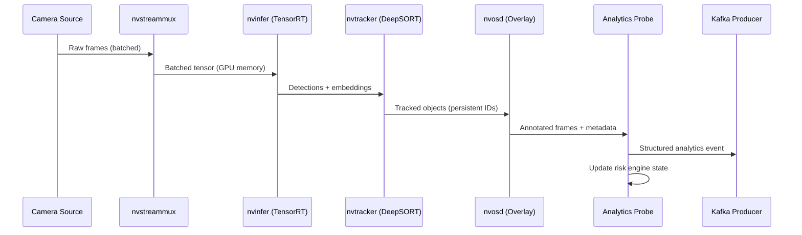
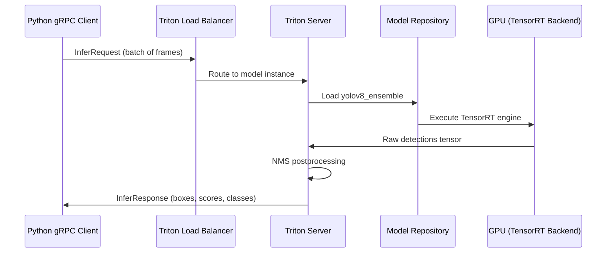

# Design Document: NVIDIA Metropolis Integration

## Overview

This design transforms the existing AI Surveillance/proctoring system into an NVIDIA Metropolis-aligned architecture while preserving the current Python pipeline as a fallback. The integration introduces TensorRT-optimized inference, DeepStream/GStreamer video pipelines, Triton Inference Server for scalable model serving, multi-camera tracking with persistent IDs, structured analytics metadata, event streaming via Kafka/MQTT, C++ performance extensions, and comprehensive benchmarking.

The architecture follows a layered approach: the existing Python pipeline remains fully functional as the "legacy" backend, while new Metropolis-aligned components are introduced as alternative backends selectable via configuration. A unified `PipelineOrchestrator` routes frames through either the legacy path or the Metropolis path based on hardware availability and user preference.

This positions the project as a portfolio-grade demonstration of NVIDIA Metropolis skills including TensorRT optimization, DeepStream pipeline construction, Triton model serving, and edge-to-cloud analytics patterns.

## Architecture

### System Context



### Pipeline Selection Architecture



## Sequence Diagrams

### TensorRT Model Export Pipeline



### DeepStream Pipeline Flow



### Triton Inference Server Request Flow



## Components and Interfaces

### Component 1: TensorRT Export Pipeline

**Purpose**: Convert YOLOv8 .pt models through ONNX to optimized TensorRT engines with FP16/INT8 quantization.

**Interface**:
```python
class TensorRTExporter:
    def __init__(self, model_path: str, output_dir: str):
        """Initialize with source .pt model and output directory."""
        ...

    def export_onnx(self, opset: int = 17, dynamic_batch: bool = True) -> str:
        """Export PyTorch model to ONNX format. Returns path to .onnx file."""
        ...

    def build_engine(
        self,
        precision: str = "fp16",  # "fp16" | "int8" | "fp32"
        max_batch_size: int = 8,
        workspace_mb: int = 4096,
        calibration_data: str | None = None,  # Required for INT8
    ) -> str:
        """Build TensorRT engine from ONNX. Returns path to .engine file."""
        ...

    def validate(self, test_images: list[str], iou_threshold: float = 0.5) -> dict:
        """Run inference on test images, compare with PyTorch baseline.
        Returns accuracy metrics (mAP, precision, recall)."""
        ...
```

**Responsibilities**:
- Handle the full .pt → ONNX → TensorRT conversion pipeline
- Support FP16 and INT8 quantization with calibration datasets
- Validate output accuracy against PyTorch baseline
- Generate engine metadata (input/output shapes, precision, build config)

### Component 2: DeepStream Pipeline Backend

**Purpose**: Provide a GStreamer/DeepStream-based video analytics pipeline as an alternative to the Python OpenCV pipeline.

**Interface**:
```python
class DeepStreamPipeline:
    def __init__(self, config: "DeepStreamConfig"):
        """Initialize GStreamer pipeline from configuration."""
        ...

    def add_source(self, source_id: int, uri: str, source_type: str = "rtsp") -> None:
        """Add a camera source to the pipeline multiplexer."""
        ...

    def start(self) -> None:
        """Start the GStreamer main loop in a background thread."""
        ...

    def stop(self) -> None:
        """Gracefully stop pipeline and release GPU resources."""
        ...

    def register_probe(self, callback: "ProbeCallback") -> None:
        """Register analytics probe callback for metadata extraction."""
        ...

    def get_stats(self) -> "PipelineStats":
        """Return current FPS, latency, GPU utilization per source."""
        ...
```

**Responsibilities**:
- Construct and manage GStreamer pipeline elements (nvstreammux, nvinfer, nvtracker, nvosd)
- Handle multi-source batching on GPU memory
- Provide zero-copy frame access for analytics probes
- Manage pipeline state transitions (NULL → PLAYING → PAUSED → NULL)

### Component 3: Triton Inference Client

**Purpose**: Interface with NVIDIA Triton Inference Server for scalable, batched model serving.

**Interface**:
```python
class TritonClient:
    def __init__(self, server_url: str = "localhost:8001", model_name: str = "yolov8_ensemble"):
        """Connect to Triton server via gRPC."""
        ...

    def infer(self, frames: list["np.ndarray"], batch_size: int | None = None) -> list["Detection"]:
        """Send batch of frames for inference. Returns detections per frame."""
        ...

    def is_model_ready(self) -> bool:
        """Check if the model is loaded and ready for inference."""
        ...

    def get_model_metadata(self) -> dict:
        """Return model input/output shapes, supported batch sizes."""
        ...

    def health_check(self) -> bool:
        """Check Triton server health status."""
        ...
```

**Responsibilities**:
- Manage gRPC connection to Triton server
- Handle frame preprocessing (resize, normalize, CHW conversion)
- Support dynamic batching for throughput optimization
- Provide fallback to local TensorRT inference if Triton is unavailable

### Component 4: Multi-Camera Tracker

**Purpose**: Maintain persistent object IDs across frames and cameras using DeepSORT/ByteTrack.

**Interface**:
```python
class MultiCameraTracker:
    def __init__(self, algorithm: str = "bytetrack", max_age: int = 30):
        """Initialize tracker with selected algorithm."""
        ...

    def update(
        self,
        camera_id: int,
        detections: list["Detection"],
        frame: "np.ndarray",
    ) -> list["TrackedObject"]:
        """Update tracker state with new detections. Returns tracked objects with IDs."""
        ...

    def cross_camera_match(self, track_id: int, target_camera: int) -> int | None:
        """Attempt to match a track across cameras using appearance features.
        Returns matched track ID on target camera, or None."""
        ...

    def get_active_tracks(self, camera_id: int | None = None) -> list["TrackedObject"]:
        """Return all active tracks, optionally filtered by camera."""
        ...
```

**Responsibilities**:
- Maintain per-camera Kalman filter state for motion prediction
- Extract and cache appearance embeddings for re-identification
- Handle track lifecycle (tentative → confirmed → lost → deleted)
- Support cross-camera re-ID via cosine similarity on embeddings

### Component 5: Analytics Metadata Schema

**Purpose**: Define structured event/object/track metadata in protobuf and JSON-LD formats.

**Interface**:
```python
class MetadataEncoder:
    def __init__(self, schema_format: str = "protobuf"):
        """Initialize encoder with output format (protobuf or json-ld)."""
        ...

    def encode_event(self, event: "AnalyticsEvent") -> bytes:
        """Serialize an analytics event to wire format."""
        ...

    def encode_object(self, obj: "TrackedObject") -> bytes:
        """Serialize a tracked object snapshot."""
        ...

    def decode_event(self, data: bytes) -> "AnalyticsEvent":
        """Deserialize an analytics event from wire format."""
        ...
```

**Responsibilities**:
- Define protobuf schemas for events, objects, and tracks
- Provide JSON-LD context for semantic interoperability
- Handle serialization/deserialization with schema versioning
- Support both compact binary (protobuf) and human-readable (JSON-LD) output

### Component 6: Event Streaming (Kafka/MQTT)

**Purpose**: Publish analytics events to message brokers for downstream consumption.

**Interface**:
```python
class EventPublisher:
    def __init__(self, broker_type: str = "kafka", config: dict = None):
        """Initialize connection to message broker."""
        ...

    def publish_event(self, topic: str, event: "AnalyticsEvent") -> None:
        """Publish a single analytics event to the specified topic."""
        ...

    def publish_batch(self, topic: str, events: list["AnalyticsEvent"]) -> None:
        """Publish a batch of events for throughput optimization."""
        ...

    def close(self) -> None:
        """Gracefully close broker connection."""
        ...
```

**Responsibilities**:
- Abstract Kafka and MQTT behind a unified publisher interface
- Handle connection management, retries, and backpressure
- Support topic-based routing (alerts, tracks, raw_detections)
- Provide delivery guarantees (at-least-once for Kafka, QoS levels for MQTT)

### Component 7: C++ Performance Extensions

**Purpose**: Provide high-performance implementations of compute-intensive operations via pybind11.

**Interface**:
```python
# Python bindings (exposed via pybind11)
import metropolis_cpp

# CUDA-accelerated preprocessing
def cuda_preprocess(
    frames: list["np.ndarray"],
    target_size: tuple[int, int] = (640, 640),
    normalize: bool = True,
) -> "np.ndarray":
    """Batch preprocess frames on GPU. Returns NCHW float32 tensor."""
    ...

# Optimized NMS
def batched_nms(
    boxes: "np.ndarray",       # (N, 4) float32
    scores: "np.ndarray",      # (N,) float32
    classes: "np.ndarray",     # (N,) int32
    iou_threshold: float = 0.45,
    score_threshold: float = 0.25,
) -> "np.ndarray":
    """GPU-accelerated batched NMS. Returns indices of kept boxes."""
    ...

# Risk engine hot path
def compute_risk_score(
    events: list[tuple[float, float]],  # (timestamp, weight) pairs
    window_secs: float,
    current_time: float,
) -> float:
    """Compute exponential-recency-weighted risk score. Returns [0, 1]."""
    ...
```

**Responsibilities**:
- CUDA kernel for batch frame preprocessing (resize, normalize, HWC→CHW)
- GPU-accelerated NMS replacing Python loop-based implementation
- C++ risk engine computation for sub-millisecond scoring
- pybind11 module exposing all functions with numpy array interop

### Component 8: Pipeline Orchestrator

**Purpose**: Route frames through either the Metropolis or legacy pipeline based on configuration and hardware availability.

**Interface**:
```python
class PipelineOrchestrator:
    def __init__(self, config: "MetropolisConfig"):
        """Initialize orchestrator with pipeline configuration."""
        ...

    def detect_capabilities(self) -> "Capabilities":
        """Probe system for available GPU, DeepStream, Triton, TensorRT."""
        ...

    def select_pipeline(self) -> str:
        """Choose optimal pipeline based on capabilities and config.
        Returns 'metropolis' | 'legacy' | 'hybrid'."""
        ...

    def start(self) -> None:
        """Start the selected pipeline."""
        ...

    def get_detections(self, camera_id: int) -> list["Detection"]:
        """Get latest detections from active pipeline (unified interface)."""
        ...
```

**Responsibilities**:
- Detect available hardware and software capabilities at startup
- Select and initialize the appropriate pipeline backend
- Provide a unified detection output interface regardless of backend
- Support hot-switching between pipelines (for A/B testing and benchmarking)

### Component 9: Benchmarking Suite

**Purpose**: Measure and compare performance metrics across pipeline configurations.

**Interface**:
```python
class BenchmarkRunner:
    def __init__(self, output_dir: str = "benchmarks/results"):
        """Initialize benchmark runner with output directory."""
        ...

    def run_inference_benchmark(
        self,
        pipeline: str,  # "legacy" | "tensorrt" | "triton" | "deepstream"
        dataset: str,
        num_iterations: int = 1000,
    ) -> "BenchmarkResult":
        """Run inference throughput/latency benchmark."""
        ...

    def run_e2e_benchmark(
        self,
        video_source: str,
        duration_secs: float = 60.0,
    ) -> "E2EBenchmarkResult":
        """Run end-to-end pipeline benchmark with real video."""
        ...

    def compare(self, results: list["BenchmarkResult"]) -> "ComparisonReport":
        """Generate comparison report across pipeline configurations."""
        ...
```

**Responsibilities**:
- Measure FPS, P50/P95/P99 latency, GPU utilization, memory usage
- Support warmup iterations and statistical significance testing
- Generate comparison reports (legacy vs TensorRT vs Triton vs DeepStream)
- Output results in JSON + markdown table format

## Data Models

### Detection (Unified Output)

```python
from dataclasses import dataclass, field
from typing import Optional

@dataclass
class Detection:
    class_id: int
    class_name: str
    confidence: float
    bbox: tuple[int, int, int, int]  # x1, y1, x2, y2
    camera_id: int
    timestamp: float
    track_id: Optional[int] = None
    embedding: Optional[list[float]] = None

    def to_dict(self) -> dict:
        return {
            "class": self.class_name,
            "confidence": round(self.confidence, 3),
            "bbox": list(self.bbox),
            "camera_id": self.camera_id,
            "track_id": self.track_id,
        }
```

**Validation Rules**:
- `confidence` must be in [0.0, 1.0]
- `bbox` coordinates must be non-negative and x2 > x1, y2 > y1
- `class_id` must map to a valid class in the model's label set
- `track_id` is None for untracked detections, positive integer otherwise

### TrackedObject

```python
@dataclass
class TrackedObject:
    track_id: int
    camera_id: int
    class_name: str
    bbox: tuple[int, int, int, int]
    velocity: tuple[float, float]  # pixels/sec (dx, dy)
    age: int  # frames since first seen
    hits: int  # frames with matched detection
    time_since_update: int  # frames since last matched detection
    state: str  # "tentative" | "confirmed" | "lost"
    embedding: list[float] = field(default_factory=list)
```

**Validation Rules**:
- `track_id` must be a positive integer, unique within a camera
- `state` must be one of: "tentative", "confirmed", "lost"
- `age` >= `hits` (can't have more hits than frames alive)
- `time_since_update` resets to 0 on each matched detection

### AnalyticsEvent (Protobuf Schema)

```python
@dataclass
class AnalyticsEvent:
    event_id: str  # UUID
    event_type: str  # "object_detected" | "track_created" | "alert_fired" | "track_lost"
    timestamp: float  # Unix epoch
    camera_id: int
    source_pipeline: str  # "metropolis" | "legacy"
    objects: list[Detection] = field(default_factory=list)
    tracks: list[TrackedObject] = field(default_factory=list)
    risk_score: float = 0.0
    metadata: dict = field(default_factory=dict)
```

**Validation Rules**:
- `event_id` must be a valid UUID v4
- `event_type` must be from the defined enum set
- `timestamp` must be a positive float (Unix epoch)
- `risk_score` must be in [0.0, 1.0]

### MetropolisConfig

```python
@dataclass
class MetropolisConfig:
    # Pipeline selection
    pipeline_mode: str = "auto"  # "auto" | "metropolis" | "legacy" | "hybrid"

    # TensorRT
    tensorrt_engine_path: str = "models/yolov8m_fp16.engine"
    tensorrt_precision: str = "fp16"  # "fp16" | "int8" | "fp32"
    tensorrt_max_batch: int = 8
    tensorrt_workspace_mb: int = 4096

    # DeepStream
    deepstream_config_path: str = "configs/deepstream_app.txt"
    deepstream_tracker: str = "bytetrack"  # "deepsort" | "bytetrack" | "nvdcf"
    deepstream_batch_size: int = 4

    # Triton
    triton_server_url: str = "localhost:8001"
    triton_model_name: str = "yolov8_ensemble"
    triton_dynamic_batching: bool = True
    triton_max_queue_delay_us: int = 100

    # Tracking
    tracker_algorithm: str = "bytetrack"
    tracker_max_age: int = 30
    tracker_min_hits: int = 3
    cross_camera_reid: bool = True
    reid_threshold: float = 0.7

    # Event streaming
    broker_type: str = "kafka"  # "kafka" | "mqtt" | "none"
    kafka_bootstrap_servers: str = "localhost:9092"
    mqtt_broker_url: str = "localhost:1883"
    event_topics: dict = field(default_factory=lambda: {
        "alerts": "surveillance.alerts",
        "tracks": "surveillance.tracks",
        "raw": "surveillance.detections.raw",
    })

    # Benchmarking
    benchmark_warmup_iterations: int = 50
    benchmark_test_iterations: int = 1000
```

### Triton Model Repository Structure

```python
# Directory layout for Triton model repository
MODEL_REPOSITORY = {
    "models/": {
        "yolov8_preprocessing/": {
            "1/": {"model.py": "# Python backend for preprocessing"},
            "config.pbtxt": """
                name: "yolov8_preprocessing"
                backend: "python"
                input [{ name: "raw_image", data_type: TYPE_UINT8, dims: [-1, -1, 3] }]
                output [{ name: "processed", data_type: TYPE_FP32, dims: [3, 640, 640] }]
                instance_group [{ count: 2, kind: KIND_GPU }]
            """,
        },
        "yolov8_detector/": {
            "1/": {"model.plan": "# TensorRT engine file"},
            "config.pbtxt": """
                name: "yolov8_detector"
                platform: "tensorrt_plan"
                input [{ name: "images", data_type: TYPE_FP32, dims: [3, 640, 640] }]
                output [{ name: "output0", data_type: TYPE_FP32, dims: [84, 8400] }]
                dynamic_batching { max_queue_delay_microseconds: 100 }
                instance_group [{ count: 1, kind: KIND_GPU }]
            """,
        },
        "yolov8_postprocessing/": {
            "1/": {"model.py": "# Python backend for NMS + formatting"},
            "config.pbtxt": """
                name: "yolov8_postprocessing"
                backend: "python"
                input [{ name: "raw_output", data_type: TYPE_FP32, dims: [84, 8400] }]
                output [{ name: "detections", data_type: TYPE_FP32, dims: [-1, 6] }]
                instance_group [{ count: 2, kind: KIND_GPU }]
            """,
        },
        "yolov8_ensemble/": {
            "1/": {},
            "config.pbtxt": """
                name: "yolov8_ensemble"
                platform: "ensemble"
                input [{ name: "raw_image", data_type: TYPE_UINT8, dims: [-1, -1, 3] }]
                output [{ name: "detections", data_type: TYPE_FP32, dims: [-1, 6] }]
                ensemble_scheduling { step [
                    { model_name: "yolov8_preprocessing" ... },
                    { model_name: "yolov8_detector" ... },
                    { model_name: "yolov8_postprocessing" ... }
                ]}
            """,
        },
    },
}
```

### Docker Configuration

```python
# Docker compose service definitions (conceptual)
DOCKER_SERVICES = {
    "triton": {
        "image": "nvcr.io/nvidia/tritoninferenceserver:24.01-py3",
        "runtime": "nvidia",
        "ports": ["8000:8000", "8001:8001", "8002:8002"],
        "volumes": ["./models:/models"],
        "command": "tritonserver --model-repository=/models",
    },
    "deepstream": {
        "image": "nvcr.io/nvidia/deepstream:7.0-triton-multiarch",
        "runtime": "nvidia",
        "volumes": ["./configs:/configs", "./models:/models"],
    },
    "kafka": {
        "image": "confluentinc/cp-kafka:7.5.0",
        "ports": ["9092:9092"],
    },
    "app": {
        "build": {"context": ".", "dockerfile": "Dockerfile.metropolis"},
        "runtime": "nvidia",
        "depends_on": ["triton", "kafka"],
    },
}
```

## Algorithmic Pseudocode

### TensorRT Export Algorithm

```python
def export_tensorrt_pipeline(model_path: str, precision: str, calibration_data: str | None) -> str:
    """
    Full export pipeline: .pt → ONNX → TensorRT engine.

    Preconditions:
        - model_path points to a valid YOLOv8 .pt file
        - precision is one of "fp32", "fp16", "int8"
        - If precision == "int8", calibration_data must be a valid directory of images

    Postconditions:
        - Returns path to a valid .engine file
        - Engine produces outputs within 1% mAP of the original .pt model (FP16)
        - Engine produces outputs within 2% mAP of the original .pt model (INT8)

    Loop Invariants: N/A (sequential pipeline)
    """
    # Step 1: Load and export to ONNX
    model = YOLO(model_path)
    onnx_path = model.export(
        format="onnx",
        opset=17,
        dynamic=True,
        simplify=True,
    )

    # Step 2: Build TensorRT engine
    builder = trt.Builder(TRT_LOGGER)
    network = builder.create_network(1 << int(trt.NetworkDefinitionCreationFlag.EXPLICIT_BATCH))
    parser = trt.OnnxParser(network, TRT_LOGGER)

    with open(onnx_path, "rb") as f:
        parser.parse(f.read())

    config = builder.create_builder_config()
    config.set_memory_pool_limit(trt.MemoryPoolType.WORKSPACE, 4 * (1 << 30))  # 4GB

    if precision == "fp16":
        config.set_flag(trt.BuilderFlag.FP16)
    elif precision == "int8":
        config.set_flag(trt.BuilderFlag.INT8)
        config.int8_calibrator = EntropyCalibrator(calibration_data)

    # Set dynamic batch profile
    profile = builder.create_optimization_profile()
    profile.set_shape("images", min=(1, 3, 640, 640), opt=(4, 3, 640, 640), max=(8, 3, 640, 640))
    config.add_optimization_profile(profile)

    engine = builder.build_serialized_network(network, config)
    engine_path = model_path.replace(".pt", f"_{precision}.engine")

    with open(engine_path, "wb") as f:
        f.write(engine)

    return engine_path
```

### DeepStream Pipeline Construction

```python
def build_deepstream_pipeline(sources: list[str], config: "DeepStreamConfig") -> "Gst.Pipeline":
    """
    Construct a GStreamer/DeepStream pipeline for multi-source analytics.

    Preconditions:
        - All source URIs are reachable (RTSP streams or valid file paths)
        - TensorRT engine exists at config.engine_path
        - DeepStream SDK is installed and GStreamer is available

    Postconditions:
        - Pipeline is in READY state, can transition to PLAYING
        - All sources are connected to the stream muxer
        - Inference, tracking, and OSD elements are linked
        - Analytics probe is attached for metadata extraction

    Loop Invariants:
        - For each source added: source_bin is linked to streammux sink pad
    """
    Gst.init(None)
    pipeline = Gst.Pipeline()

    # Create elements
    streammux = Gst.ElementFactory.make("nvstreammux", "mux")
    streammux.set_property("batch-size", len(sources))
    streammux.set_property("width", 1920)
    streammux.set_property("height", 1080)
    streammux.set_property("batched-push-timeout", 40000)  # 40ms

    nvinfer = Gst.ElementFactory.make("nvinfer", "primary-inference")
    nvinfer.set_property("config-file-path", config.nvinfer_config)

    tracker = Gst.ElementFactory.make("nvtracker", "tracker")
    tracker.set_property("tracker-width", 640)
    tracker.set_property("tracker-height", 384)
    tracker.set_property("ll-lib-file", config.tracker_lib)
    tracker.set_property("ll-config-file", config.tracker_config)

    nvosd = Gst.ElementFactory.make("nvdsosd", "osd")
    sink = Gst.ElementFactory.make("fakesink", "sink")  # Probe extracts data

    pipeline.add(streammux, nvinfer, tracker, nvosd, sink)
    streammux.link(nvinfer)
    nvinfer.link(tracker)
    tracker.link(nvosd)
    nvosd.link(sink)

    # Add sources
    for i, uri in enumerate(sources):
        source_bin = create_source_bin(i, uri)
        pipeline.add(source_bin)
        pad = streammux.get_request_pad(f"sink_{i}")
        source_bin.get_static_pad("src").link(pad)

    # Attach analytics probe
    osd_sink_pad = nvosd.get_static_pad("sink")
    osd_sink_pad.add_probe(Gst.PadProbeType.BUFFER, analytics_probe_callback, None)

    return pipeline
```

### ByteTrack Multi-Object Tracking Algorithm

```python
def bytetrack_update(
    tracker_state: "ByteTrackState",
    detections: list["Detection"],
    frame: "np.ndarray",
) -> list["TrackedObject"]:
    """
    Update ByteTrack state with new detections for a single frame.

    Preconditions:
        - detections is a list of valid Detection objects with confidence > 0
        - frame is a valid BGR numpy array matching the camera resolution
        - tracker_state contains valid Kalman filter states for existing tracks

    Postconditions:
        - All high-confidence detections are matched to existing tracks or create new tracks
        - Low-confidence detections are used for second-pass matching with lost tracks
        - Returned TrackedObjects have updated bboxes, velocities, and states
        - No two active tracks share the same track_id

    Loop Invariants:
        - After each matching pass: matched tracks have time_since_update = 0
        - Unmatched tracks increment time_since_update by 1
        - Tracks with time_since_update > max_age are deleted
    """
    HIGH_THRESH = 0.5
    LOW_THRESH = 0.1

    # Split detections by confidence
    high_dets = [d for d in detections if d.confidence >= HIGH_THRESH]
    low_dets = [d for d in detections if LOW_THRESH <= d.confidence < HIGH_THRESH]

    # Predict new positions for all existing tracks
    for track in tracker_state.active_tracks:
        track.predict()  # Kalman filter prediction step

    # First association: high-confidence detections ↔ active tracks
    cost_matrix = compute_iou_cost(tracker_state.active_tracks, high_dets)
    matched_h, unmatched_tracks_h, unmatched_dets_h = hungarian_match(cost_matrix, threshold=0.8)

    for track_idx, det_idx in matched_h:
        tracker_state.active_tracks[track_idx].update(high_dets[det_idx])

    # Second association: low-confidence detections ↔ remaining tracks
    remaining_tracks = [tracker_state.active_tracks[i] for i in unmatched_tracks_h]
    cost_matrix_2 = compute_iou_cost(remaining_tracks, low_dets)
    matched_l, unmatched_tracks_l, _ = hungarian_match(cost_matrix_2, threshold=0.5)

    for track_idx, det_idx in matched_l:
        remaining_tracks[track_idx].update(low_dets[det_idx])

    # Handle unmatched tracks (mark as lost, eventually delete)
    for track_idx in unmatched_tracks_l:
        track = remaining_tracks[track_idx]
        track.time_since_update += 1
        if track.time_since_update > tracker_state.max_age:
            track.state = "lost"

    # Create new tracks from unmatched high-confidence detections
    for det_idx in unmatched_dets_h:
        new_track = TrackedObject(
            track_id=tracker_state.next_id(),
            detection=high_dets[det_idx],
            state="tentative",
        )
        tracker_state.active_tracks.append(new_track)

    # Promote tentative tracks with enough hits
    for track in tracker_state.active_tracks:
        if track.state == "tentative" and track.hits >= tracker_state.min_hits:
            track.state = "confirmed"

    # Remove dead tracks
    tracker_state.active_tracks = [
        t for t in tracker_state.active_tracks if t.state != "lost"
    ]

    return [t for t in tracker_state.active_tracks if t.state == "confirmed"]
```

### Cross-Camera Re-Identification

```python
def cross_camera_reid(
    query_embedding: list[float],
    gallery: dict[int, list["TrackedObject"]],  # camera_id -> tracks
    threshold: float = 0.7,
) -> tuple[int, int] | None:
    """
    Match a track's appearance embedding across cameras.

    Preconditions:
        - query_embedding is a normalized L2 feature vector (len == 128 or 256)
        - gallery contains at least one camera with active confirmed tracks
        - threshold is in (0.0, 1.0)

    Postconditions:
        - Returns (camera_id, track_id) of best match if cosine_sim >= threshold
        - Returns None if no match exceeds threshold
        - Does not modify gallery state

    Loop Invariants:
        - best_score tracks the maximum cosine similarity seen so far
    """
    best_score = 0.0
    best_match = None

    query_norm = np.array(query_embedding) / (np.linalg.norm(query_embedding) + 1e-8)

    for cam_id, tracks in gallery.items():
        for track in tracks:
            if not track.embedding or track.state != "confirmed":
                continue
            gallery_norm = np.array(track.embedding) / (np.linalg.norm(track.embedding) + 1e-8)
            similarity = float(np.dot(query_norm, gallery_norm))

            if similarity > best_score:
                best_score = similarity
                best_match = (cam_id, track.track_id)

    if best_score >= threshold:
        return best_match
    return None
```

### Pipeline Orchestrator Selection Logic

```python
def select_pipeline(config: "MetropolisConfig") -> str:
    """
    Determine which pipeline backend to use based on hardware and config.

    Preconditions:
        - config is a valid MetropolisConfig instance
        - System hardware has been probed

    Postconditions:
        - Returns one of: "metropolis", "legacy", "hybrid"
        - "metropolis" only returned if GPU + DeepStream + TensorRT all available
        - "legacy" always works as fallback
        - "hybrid" uses TensorRT inference with Python tracking/routing

    Loop Invariants: N/A (decision tree)
    """
    if config.pipeline_mode != "auto":
        return config.pipeline_mode

    capabilities = detect_capabilities()

    if (
        capabilities.has_nvidia_gpu
        and capabilities.has_deepstream
        and capabilities.has_tensorrt_engine
        and capabilities.has_triton
    ):
        return "metropolis"

    if capabilities.has_nvidia_gpu and capabilities.has_tensorrt_engine:
        return "hybrid"  # TensorRT inference, Python pipeline

    return "legacy"
```

## Key Functions with Formal Specifications

### Function 1: TensorRTExporter.build_engine()

```python
def build_engine(self, precision: str, max_batch_size: int, workspace_mb: int, calibration_data: str | None) -> str:
    ...
```

**Preconditions:**
- `self.onnx_path` exists and is a valid ONNX model file
- `precision` ∈ {"fp32", "fp16", "int8"}
- `max_batch_size` > 0 and ≤ 32
- `workspace_mb` > 0 and ≤ available GPU memory
- If `precision == "int8"`: `calibration_data` is a directory with ≥ 100 representative images

**Postconditions:**
- Returns a valid file path ending in `.engine`
- The engine file is loadable by `trt.Runtime`
- Engine accepts input shape `(1..max_batch_size, 3, 640, 640)`
- Engine produces output shape `(batch, 84, 8400)` for YOLOv8

**Loop Invariants:** N/A

### Function 2: DeepStreamPipeline.start()

```python
def start(self) -> None:
    ...
```

**Preconditions:**
- Pipeline is in NULL or READY state
- All source URIs are reachable
- TensorRT engine file exists at configured path
- GStreamer and DeepStream plugins are available

**Postconditions:**
- Pipeline transitions to PLAYING state
- GStreamer main loop is running in a daemon thread
- Frames are flowing through the pipeline
- Analytics probe is receiving metadata callbacks

**Loop Invariants:**
- GStreamer main loop: pipeline remains in PLAYING state until stop() is called
- Each iteration processes one buffer from the pipeline queue

### Function 3: MultiCameraTracker.update()

```python
def update(self, camera_id: int, detections: list["Detection"], frame: "np.ndarray") -> list["TrackedObject"]:
    ...
```

**Preconditions:**
- `camera_id` is a valid registered camera identifier
- `detections` contains only Detection objects with valid bboxes within frame dimensions
- `frame` is a valid BGR numpy array with shape (H, W, 3)

**Postconditions:**
- Returns list of TrackedObjects with state == "confirmed"
- Each returned object has a unique `track_id` within this camera
- Track positions are updated via Kalman filter prediction + detection correction
- New tracks are created for unmatched high-confidence detections
- Lost tracks (time_since_update > max_age) are removed

**Loop Invariants:**
- Hungarian matching: each detection matches at most one track, each track matches at most one detection
- After matching: sum(matched) + sum(unmatched_tracks) + sum(unmatched_dets) == total inputs

### Function 4: EventPublisher.publish_event()

```python
def publish_event(self, topic: str, event: "AnalyticsEvent") -> None:
    ...
```

**Preconditions:**
- Broker connection is established and healthy
- `topic` is a non-empty string matching configured topic pattern
- `event` is a valid AnalyticsEvent with all required fields populated

**Postconditions:**
- Event is serialized and delivered to the broker (at-least-once for Kafka)
- Event timestamp is preserved in the message
- If broker is unreachable: event is queued locally for retry (max 1000 events)
- No exception is raised to caller (errors are logged internally)

**Loop Invariants:** N/A (single operation)

### Function 5: cuda_preprocess()

```python
def cuda_preprocess(frames: list["np.ndarray"], target_size: tuple[int, int], normalize: bool) -> "np.ndarray":
    ...
```

**Preconditions:**
- `frames` is a non-empty list of valid BGR numpy arrays
- All frames have 3 channels (shape[-1] == 3)
- `target_size` contains positive integers (width, height)
- CUDA device is available and has sufficient memory for the batch

**Postconditions:**
- Returns numpy array with shape (N, 3, target_size[1], target_size[0]) where N = len(frames)
- dtype is float32
- If normalize: pixel values are in [0.0, 1.0]
- If not normalize: pixel values are in [0, 255] as float32
- Channel order is RGB (converted from BGR input)
- Memory layout is contiguous (C-order)

**Loop Invariants:**
- For each frame processed: GPU memory allocation does not exceed batch_size * 3 * H * W * 4 bytes

### Function 6: BenchmarkRunner.run_inference_benchmark()

```python
def run_inference_benchmark(self, pipeline: str, dataset: str, num_iterations: int) -> "BenchmarkResult":
    ...
```

**Preconditions:**
- `pipeline` ∈ {"legacy", "tensorrt", "triton", "deepstream"}
- `dataset` is a valid directory containing test images
- `num_iterations` > 0
- The specified pipeline backend is available and initialized

**Postconditions:**
- Returns BenchmarkResult with: fps, latency_p50, latency_p95, latency_p99, gpu_util_avg, memory_peak_mb
- All latency values are in milliseconds
- fps > 0 (at least one frame was processed)
- Results exclude warmup iterations (first `warmup_iterations` are discarded)
- GPU utilization is averaged over the test duration

**Loop Invariants:**
- For each iteration: latency measurement includes only inference time (not data loading)
- Running statistics are updated after each iteration

## Example Usage

### TensorRT Export

```python
from metropolis.export import TensorRTExporter

# Export YOLOv8m to TensorRT FP16
exporter = TensorRTExporter(
    model_path="yolov8m.pt",
    output_dir="models/tensorrt/"
)
onnx_path = exporter.export_onnx(opset=17, dynamic_batch=True)
engine_path = exporter.build_engine(
    precision="fp16",
    max_batch_size=8,
    workspace_mb=4096,
)

# Validate accuracy
metrics = exporter.validate(
    test_images=glob("phone-detection/test/images/*.jpg"),
    iou_threshold=0.5,
)
print(f"mAP@0.5: {metrics['map50']:.3f} (baseline: {metrics['baseline_map50']:.3f})")
```

### DeepStream Pipeline

```python
from metropolis.deepstream import DeepStreamPipeline, DeepStreamConfig

config = DeepStreamConfig(
    engine_path="models/tensorrt/yolov8m_fp16.engine",
    tracker="bytetrack",
    batch_size=4,
)
pipeline = DeepStreamPipeline(config)
pipeline.add_source(0, "rtsp://camera1:554/stream")
pipeline.add_source(1, "rtsp://camera2:554/stream")
pipeline.register_probe(analytics_callback)
pipeline.start()

# Pipeline runs in background, probe fires on each batch
stats = pipeline.get_stats()
print(f"FPS: {stats.fps}, Latency: {stats.latency_ms}ms")
```

### Triton Client Usage

```python
from metropolis.triton_client import TritonClient

client = TritonClient(server_url="localhost:8001", model_name="yolov8_ensemble")

if client.is_model_ready():
    frames = [cv2.imread(f) for f in image_paths]
    detections = client.infer(frames, batch_size=4)
    for frame_dets in detections:
        for det in frame_dets:
            print(f"{det.class_name}: {det.confidence:.2f} at {det.bbox}")
```

### Multi-Camera Tracking

```python
from metropolis.tracker import MultiCameraTracker

tracker = MultiCameraTracker(algorithm="bytetrack", max_age=30)

# Per-frame update
tracked = tracker.update(camera_id=0, detections=raw_detections, frame=frame)
for obj in tracked:
    print(f"Track {obj.track_id}: {obj.class_name} at {obj.bbox} (state={obj.state})")

# Cross-camera re-identification
match = tracker.cross_camera_match(track_id=42, target_camera=1)
if match:
    print(f"Track 42 from cam 0 matches track {match} on cam 1")
```

### Event Streaming

```python
from metropolis.streaming import EventPublisher
from metropolis.schema import AnalyticsEvent, MetadataEncoder

publisher = EventPublisher(broker_type="kafka", config={"bootstrap_servers": "localhost:9092"})
encoder = MetadataEncoder(schema_format="protobuf")

event = AnalyticsEvent(
    event_id=str(uuid4()),
    event_type="alert_fired",
    timestamp=time.time(),
    camera_id=0,
    source_pipeline="metropolis",
    objects=detections,
    risk_score=0.85,
)
publisher.publish_event("surveillance.alerts", event)
```

### Benchmarking

```python
from metropolis.benchmark import BenchmarkRunner

runner = BenchmarkRunner(output_dir="benchmarks/results")

# Compare all pipelines
results = []
for pipeline in ["legacy", "tensorrt", "triton", "deepstream"]:
    result = runner.run_inference_benchmark(
        pipeline=pipeline,
        dataset="phone-detection/test/images",
        num_iterations=1000,
    )
    results.append(result)
    print(f"{pipeline}: {result.fps:.1f} FPS, P95={result.latency_p95:.1f}ms")

report = runner.compare(results)
report.save_markdown("benchmarks/results/comparison.md")
```

## Correctness Properties

### Property 1: Pipeline Equivalence

For any input frame, the Metropolis pipeline and legacy pipeline must produce detections with IoU ≥ 0.9 for matched objects (allowing for minor numerical differences from quantization).

**Validates: Requirements 10.4**

### Property 2: Track ID Persistence

∀ track T, if T is visible in consecutive frames f_i and f_{i+1} with IoU(bbox_i, bbox_{i+1}) > 0.3, then T retains the same track_id in both frames.

**Validates: Requirements 5.2**

### Property 3: TensorRT Accuracy Preservation

For FP16 quantization, mAP@0.5 of the TensorRT engine must be within 1% of the PyTorch baseline. For INT8, within 2%.

**Validates: Requirements 1.4**

### Property 4: Event Ordering

∀ events e1, e2 from the same camera, if e1.timestamp < e2.timestamp, then e1 is published to Kafka before e2 (per-partition ordering guarantee).

**Validates: Requirements 7.5**

### Property 5: Metadata Schema Completeness

∀ AnalyticsEvent e published to any topic, e must have all required fields populated (event_id, event_type, timestamp, camera_id, source_pipeline).

**Validates: Requirements 6.5**

### Property 6: Graceful Degradation

If Triton server becomes unavailable, the system must fall back to local TensorRT inference within 1 second without dropping frames.

**Validates: Requirements 3.5**

### Property 7: Cross-Camera Re-ID Consistency

If track T on camera A is matched to track U on camera B with similarity S, then no other track on camera B has similarity > S with T.

**Validates: Requirements 5.5**

### Property 8: Benchmark Reproducibility

Running the same benchmark configuration twice on the same hardware must produce FPS results within 5% of each other (after warmup).

**Validates: Requirements 9.5**

### Property 9: Docker Isolation

The containerized application must produce identical detection results to the non-containerized version given the same input video and model.

**Validates: Requirements 4.1**

### Property 10: C++ Extension Equivalence

For any input, `metropolis_cpp.batched_nms(boxes, scores, classes, iou_thresh)` must return the same indices as the Python reference implementation `torchvision.ops.nms()`.

**Validates: Requirements 8.2**

## Error Handling

### Error Scenario 1: TensorRT Engine Build Failure

**Condition**: ONNX model contains unsupported operations or GPU memory is insufficient for the workspace.
**Response**: Log detailed error with unsupported op names. Fall back to FP32 precision. If still failing, abort export and report minimum GPU memory required.
**Recovery**: User adjusts workspace_mb or uses a smaller model variant.

### Error Scenario 2: DeepStream Pipeline Stall

**Condition**: A camera source becomes unreachable or stops producing frames.
**Response**: nvstreammux detects timeout (configurable, default 5s). Pipeline emits EOS for that source. Other sources continue processing.
**Recovery**: Automatic reconnection attempt every 10 seconds. After 3 failures, source is marked as offline and removed from the mux.

### Error Scenario 3: Triton Server Unavailable

**Condition**: gRPC connection to Triton fails or times out (>500ms).
**Response**: TritonClient raises `TritonUnavailableError`. PipelineOrchestrator catches and switches to local TensorRT inference.
**Recovery**: Background health check thread pings Triton every 5 seconds. When healthy, automatically switches back to Triton.

### Error Scenario 4: Kafka Broker Unreachable

**Condition**: Kafka producer cannot connect or publish times out.
**Response**: Events are buffered in a local ring buffer (max 1000 events). Warning logged every 30 seconds.
**Recovery**: When broker reconnects, buffered events are flushed in order. If buffer overflows, oldest events are dropped with a counter metric.

### Error Scenario 5: GPU Out of Memory

**Condition**: CUDA OOM during inference or preprocessing.
**Response**: Catch `torch.cuda.OutOfMemoryError`. Reduce batch size by half. Clear CUDA cache. Retry.
**Recovery**: If OOM persists at batch_size=1, fall back to CPU inference for that frame and log critical warning.

### Error Scenario 6: C++ Extension Load Failure

**Condition**: pybind11 module fails to import (missing .so, ABI mismatch).
**Response**: ImportError caught at startup. System logs warning and uses Python fallback implementations.
**Recovery**: No automatic recovery needed — Python fallbacks provide identical functionality at lower performance.

## Testing Strategy

### Unit Testing Approach

- **TensorRT Export**: Test ONNX export produces valid file, engine builds without error, engine accepts expected input shapes
- **Tracker**: Test track creation, update, deletion lifecycle. Test Hungarian matching with known cost matrices.
- **Metadata Schema**: Test serialization/deserialization roundtrip for all event types
- **Event Publisher**: Test publish with mock broker, test retry logic, test buffer overflow behavior
- **C++ Extensions**: Test NMS output matches Python reference for edge cases (empty input, single box, all overlapping)
- **Config**: Test pipeline selection logic for all hardware capability combinations

### Property-Based Testing Approach

**Property Test Library**: hypothesis (Python)

Key properties to test:
- **NMS Idempotence**: Applying NMS twice to the same input produces the same output
- **Tracker Monotonicity**: Track IDs are monotonically increasing (no ID reuse)
- **Serialization Roundtrip**: encode(decode(event)) == event for all valid events
- **Risk Score Bounds**: For any sequence of detection events, risk score ∈ [0.0, 1.0]
- **Preprocessing Determinism**: Same input frame always produces same preprocessed tensor

### Integration Testing Approach

- **Pipeline E2E**: Feed recorded video through both legacy and Metropolis pipelines, compare detection outputs
- **Triton Integration**: Start Triton container, load model, verify inference matches local TensorRT
- **Kafka Integration**: Publish events, consume from topic, verify ordering and completeness
- **Docker E2E**: Build container, run inference on test video, compare with host results
- **Benchmark Regression**: Run benchmark suite, compare against stored baseline, fail if >10% regression

## Performance Considerations

### Target Metrics

| Pipeline | Target FPS (1080p) | P95 Latency | GPU Memory |
|----------|-------------------|-------------|------------|
| Legacy (PyTorch) | 15-25 | 80ms | 2GB |
| TensorRT FP16 | 60-90 | 15ms | 1.2GB |
| TensorRT INT8 | 90-120 | 10ms | 0.8GB |
| Triton (batched) | 80-100 | 20ms | 1.5GB |
| DeepStream | 100-150 | 12ms | 1.8GB |

### Optimization Strategies

1. **Zero-copy GPU memory**: DeepStream keeps frames in GPU memory from decode through inference — no CPU↔GPU transfers
2. **Dynamic batching**: Triton accumulates requests up to max_queue_delay_us before executing a batch
3. **CUDA streams**: Overlap preprocessing of batch N+1 with inference of batch N
4. **INT8 calibration**: Use representative exam hall images for calibration to minimize accuracy loss
5. **C++ hot paths**: NMS and preprocessing in C++/CUDA eliminate Python GIL bottleneck

### Memory Budget

- TensorRT engine: ~200MB (FP16) / ~100MB (INT8)
- Tracker state per camera: ~5MB (embeddings + Kalman states for 100 tracks)
- Kafka producer buffer: ~10MB (1000 events × 10KB average)
- Frame preprocessing buffer: ~50MB (batch of 8 × 1080p frames)
- Total additional GPU memory: ~500MB beyond existing system

## Security Considerations

1. **Triton Server Access**: gRPC endpoint should be bound to localhost or internal network only. No authentication by default — use network isolation.
2. **Kafka Authentication**: Support SASL/SCRAM authentication for production deployments. Development mode uses plaintext.
3. **Docker Security**: Run containers with `--security-opt no-new-privileges`. Mount model directory as read-only.
4. **Model Integrity**: Store SHA256 hash of TensorRT engines. Verify before loading to prevent tampering.
5. **Event Data**: Analytics events may contain bounding box coordinates but never raw frame pixels. PII (face embeddings) are never published to Kafka.
6. **NGC Image Provenance**: Pin specific image tags (not `latest`). Verify image digests in CI.

## Dependencies

### New Python Dependencies

| Package | Version | Purpose |
|---------|---------|---------|
| tensorrt | ≥8.6 | TensorRT engine building and inference |
| pycuda | ≥2022.2 | CUDA memory management for TensorRT |
| tritonclient[grpc] | ≥2.40 | Triton Inference Server gRPC client |
| pyds | (DeepStream SDK) | DeepStream Python bindings |
| gi (PyGObject) | ≥3.42 | GStreamer Python bindings |
| confluent-kafka | ≥2.3 | Kafka producer/consumer |
| paho-mqtt | ≥1.6 | MQTT client |
| protobuf | ≥4.25 | Protocol buffer serialization |
| scipy | ≥1.11 | Hungarian algorithm for tracking |
| filterpy | ≥1.4 | Kalman filter implementation |
| hypothesis | ≥6.92 | Property-based testing |
| pybind11 | ≥2.11 | C++ extension bindings |
| nvidia-pyindex | latest | NVIDIA package index |

### System Dependencies

| Component | Version | Purpose |
|-----------|---------|---------|
| NVIDIA Driver | ≥535 | GPU access |
| CUDA Toolkit | ≥12.2 | CUDA runtime |
| cuDNN | ≥8.9 | Deep learning primitives |
| TensorRT | ≥8.6 | Inference optimization |
| DeepStream SDK | ≥7.0 | Video analytics pipeline |
| GStreamer | ≥1.20 | Media framework |
| Docker + nvidia-container-toolkit | ≥2.13 | GPU container runtime |
| Kafka | ≥3.5 (via Docker) | Message broker |

### NGC Base Images

| Image | Tag | Purpose |
|-------|-----|---------|
| nvcr.io/nvidia/tritoninferenceserver | 24.01-py3 | Triton model serving |
| nvcr.io/nvidia/deepstream | 7.0-triton-multiarch | DeepStream pipeline |
| nvcr.io/nvidia/tensorrt | 24.01-py3 | TensorRT development |
| nvcr.io/nvidia/cuda | 12.2.0-runtime-ubuntu22.04 | Application base |

### Project Structure (New Files)

```
surveillance-app/
├── backend/
│   ├── metropolis/                    # New Metropolis module
│   │   ├── __init__.py
│   │   ├── config.py                  # MetropolisConfig dataclass
│   │   ├── orchestrator.py            # PipelineOrchestrator
│   │   ├── export_tensorrt.py         # TensorRT export pipeline
│   │   ├── deepstream_pipeline.py     # DeepStream backend
│   │   ├── triton_client.py           # Triton gRPC client
│   │   ├── tracker.py                 # MultiCameraTracker
│   │   ├── schema.py                  # AnalyticsEvent, MetadataEncoder
│   │   ├── streaming.py              # EventPublisher (Kafka/MQTT)
│   │   └── benchmark.py              # BenchmarkRunner
│   ├── cpp_extensions/                # C++ performance modules
│   │   ├── CMakeLists.txt
│   │   ├── src/
│   │   │   ├── nms.cu                 # CUDA NMS kernel
│   │   │   ├── preprocess.cu          # CUDA preprocessing
│   │   │   └── risk_engine.cpp        # C++ risk computation
│   │   ├── bindings.cpp               # pybind11 module definition
│   │   └── setup.py                   # Build script
│   └── tests/
│       ├── test_export.py
│       ├── test_tracker.py
│       ├── test_schema.py
│       ├── test_streaming.py
│       ├── test_cpp_extensions.py
│       └── test_benchmark.py
├── configs/
│   ├── deepstream_app.txt             # DeepStream app config
│   ├── nvinfer_config.txt             # nvinfer element config
│   ├── tracker_config.yml             # nvtracker config
│   └── metropolis.yaml                # MetropolisConfig YAML
├── models/
│   ├── tensorrt/                      # Exported engines
│   └── triton_repository/             # Triton model repo
├── proto/
│   └── analytics.proto                # Protobuf schema definitions
├── docker/
│   ├── Dockerfile.metropolis          # Main app container
│   ├── Dockerfile.triton              # Custom Triton image
│   ├── docker-compose.yml             # Full stack compose
│   └── docker-compose.dev.yml         # Development overrides
├── benchmarks/
│   ├── run_benchmarks.py              # Benchmark entry point
│   └── results/                       # Stored results
└── .github/
    └── workflows/
        └── metropolis-ci.yml          # GPU-aware CI pipeline
```
