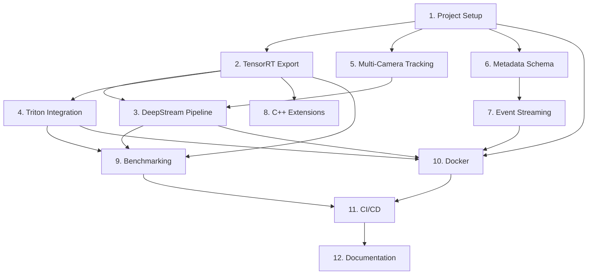

# Implementation Plan: NVIDIA Metropolis Integration

## Overview

This plan breaks down the NVIDIA Metropolis integration into 12 task groups covering project setup, TensorRT export, DeepStream pipelines, Triton serving, multi-camera tracking, metadata schemas, event streaming, C++ extensions, benchmarking, Docker containerization, CI/CD, and documentation. Tasks are ordered to build foundational components first (config, export, tracking) before integration layers (orchestrator, streaming, benchmarking).

## Task Dependency Graph



```json
{
  "waves": [
    {
      "name": "Wave 1: Foundation",
      "tasks": ["1.1", "1.2", "1.3", "1.4", "1.5", "1.6"]
    },
    {
      "name": "Wave 2: Core Components",
      "tasks": ["2.1", "2.2", "2.3", "2.4", "2.5", "2.6", "2.7", "5.1", "5.2", "5.3", "5.4", "5.5", "6.1", "6.2", "6.3", "6.4", "6.5", "6.6"]
    },
    {
      "name": "Wave 3: Integration Layer",
      "tasks": ["3.1", "3.2", "3.3", "3.4", "3.5", "3.6", "3.7", "3.8", "3.9", "4.1", "4.2", "4.3", "4.4", "4.5", "4.6", "4.7", "4.8", "4.9", "5.6", "5.7", "7.1", "7.2", "7.3", "7.4", "7.5", "7.6"]
    },
    {
      "name": "Wave 4: Performance & Extensions",
      "tasks": ["8.1", "8.2", "8.3", "8.4", "8.5", "8.6", "8.7", "9.1", "9.2", "9.3", "9.4", "9.5", "9.6", "9.7"]
    },
    {
      "name": "Wave 5: Packaging & Testing",
      "tasks": ["5.8", "5.9", "6.7", "6.8", "7.7", "7.8", "8.8", "8.9", "9.8", "10.1", "10.2", "10.3", "10.4", "10.5", "10.6", "10.7", "10.8"]
    },
    {
      "name": "Wave 6: CI/CD & Documentation",
      "tasks": ["11.1", "11.2", "11.3", "11.4", "11.5", "12.1", "12.2", "12.3", "12.4", "12.5", "12.6"]
    }
  ]
}
```

## Tasks

## 1. Project Setup and Configuration

- [x] 1.1 Create `surveillance-app/backend/metropolis/` package directory with `__init__.py`
- [x] 1.2 Create `MetropolisConfig` dataclass in `metropolis/config.py` with all configuration fields from design
- [x] 1.3 Create `configs/metropolis.yaml` with default configuration values
- [x] 1.4 Update `environment.yml` to add new dependencies (tensorrt, tritonclient, confluent-kafka, paho-mqtt, protobuf, scipy, filterpy, hypothesis, pybind11)
- [x] 1.5 Create `PipelineOrchestrator` in `metropolis/orchestrator.py` with capability detection and pipeline selection logic
- [x] 1.6 Integrate `PipelineOrchestrator` into `main.py` as alternative to direct `ExamDetector` usage

## 2. TensorRT Model Export Pipeline

- [x] 2.1 Create `metropolis/export_tensorrt.py` with `TensorRTExporter` class skeleton (init, export_onnx, build_engine, validate methods)
- [x] 2.2 Implement `export_onnx()` method using Ultralytics export with opset 17 and dynamic batch axes
- [x] 2.3 Implement `build_engine()` method with TensorRT builder, FP16/INT8 flag support, and optimization profiles
- [x] 2.4 Implement INT8 `EntropyCalibrator` class that reads calibration images from a directory
- [x] 2.5 Implement `validate()` method comparing TensorRT engine output against PyTorch baseline (mAP calculation)
- [x] 2.6 Add CLI entry point (`python -m metropolis.export_tensorrt --model --precision --calibration-data`)
- [x] 2.7 Write unit tests in `tests/test_export.py` for ONNX export and engine build (mock TensorRT for CI without GPU)

## 3. DeepStream/GStreamer Pipeline Backend

- [x] 3.1 Create `metropolis/deepstream_pipeline.py` with `DeepStreamPipeline` class and `DeepStreamConfig` dataclass
- [x] 3.2 Implement pipeline construction: nvstreammux → nvinfer → nvtracker → nvosd → fakesink
- [x] 3.3 Implement `add_source()` method creating source bins for RTSP/USB/file inputs
- [x] 3.4 Implement `start()` and `stop()` methods managing GStreamer main loop in daemon thread
- [x] 3.5 Implement analytics probe callback that extracts NvDsMeta into Detection/TrackedObject dataclasses
- [x] 3.6 Implement source fault tolerance with reconnection logic (10s interval, 3 retries)
- [x] 3.7 Create `configs/deepstream_app.txt` and `configs/nvinfer_config.txt` configuration files
- [x] 3.8 Create `configs/tracker_config.yml` for nvtracker (ByteTrack/DeepSORT settings)
- [x] 3.9 Write integration test verifying pipeline processes a test video file end-to-end

## 4. Triton Inference Server Integration

- [x] 4.1 Create Triton model repository directory structure (`models/yolov8_preprocessing/`, `models/yolov8_detector/`, `models/yolov8_postprocessing/`, `models/yolov8_ensemble/`)
- [x] 4.2 Write `config.pbtxt` for each model in the ensemble (preprocessing, detector, postprocessing, ensemble)
- [x] 4.3 Implement preprocessing model (Python backend): resize, normalize, HWC→CHW conversion
- [x] 4.4 Implement postprocessing model (Python backend): parse raw output tensor, apply NMS, format detections
- [x] 4.5 Create `metropolis/triton_client.py` with `TritonClient` class using tritonclient.grpc
- [x] 4.6 Implement `infer()` method with frame preprocessing, batch assembly, and response parsing
- [x] 4.7 Implement `health_check()` and `is_model_ready()` methods with background polling thread
- [x] 4.8 Implement fallback logic: catch gRPC errors, switch to local TensorRT, auto-recover when Triton returns
- [x] 4.9 Write unit tests with mocked gRPC responses for client logic

## 5. Multi-Camera Object Tracking

- [x] 5.1 Create `metropolis/tracker.py` with `MultiCameraTracker` class and `TrackedObject` dataclass
- [x] 5.2 Implement Kalman filter wrapper using filterpy for position/velocity state estimation
- [x] 5.3 Implement ByteTrack two-pass association: high-confidence IoU matching, then low-confidence matching
- [x] 5.4 Implement Hungarian algorithm matching using scipy.optimize.linear_sum_assignment
- [x] 5.5 Implement track lifecycle management (tentative → confirmed → lost → deleted)
- [x] 5.6 Implement appearance embedding extraction using a lightweight ReID model (or YOLO feature maps)
- [x] 5.7 Implement `cross_camera_match()` with cosine similarity on cached embeddings
- [x] 5.8 Write property-based tests with hypothesis: track ID monotonicity, no duplicate IDs, lifecycle correctness
- [x] 5.9 Write unit tests for IoU computation, cost matrix construction, and Hungarian matching

## 6. Structured Analytics Metadata Schema

- [x] 6.1 Create `proto/analytics.proto` with message definitions for AnalyticsEvent, Detection, TrackedObject
- [x] 6.2 Generate Python protobuf bindings from .proto file
- [x] 6.3 Create `metropolis/schema.py` with `MetadataEncoder` class supporting protobuf and JSON-LD formats
- [x] 6.4 Implement `encode_event()` and `decode_event()` for protobuf serialization
- [x] 6.5 Implement JSON-LD context and serialization with semantic annotations
- [x] 6.6 Implement field validation ensuring all required fields are present before encoding
- [x] 6.7 Write property-based tests: serialization roundtrip (encode then decode equals original)
- [x] 6.8 Write unit tests for each event type and edge cases (empty objects list, max field values)

## 7. Kafka/MQTT Event Streaming

- [x] 7.1 Create `metropolis/streaming.py` with `EventPublisher` class and broker-specific implementations
- [x] 7.2 Implement `KafkaPublisher` using confluent-kafka with configurable producer settings
- [x] 7.3 Implement `MQTTPublisher` using paho-mqtt with configurable QoS levels
- [x] 7.4 Implement local ring buffer (max 1000 events) for broker unavailability with ordered flush on reconnect
- [x] 7.5 Implement topic-based routing (alerts, tracks, raw_detections) with per-camera partition keys
- [x] 7.6 Implement connection health monitoring with automatic reconnection
- [x] 7.7 Write unit tests with mock brokers for publish, retry, and buffer overflow scenarios
- [x] 7.8 Write integration test: publish events to Kafka container, consume and verify ordering

## 8. C++ Performance Extensions

- [x] 8.1 Create `cpp_extensions/` directory with `CMakeLists.txt` and `setup.py` build configuration
- [x] 8.2 Implement CUDA preprocessing kernel (`preprocess.cu`): batch resize, BGR→RGB, HWC→CHW, normalize
- [x] 8.3 Implement CUDA NMS kernel (`nms.cu`): batched non-maximum suppression with IoU threshold
- [x] 8.4 Implement C++ risk engine (`risk_engine.cpp`): exponential-recency-weighted score computation
- [x] 8.5 Create pybind11 bindings (`bindings.cpp`) exposing all functions with numpy array interop
- [x] 8.6 Implement Python fallback functions that mirror C++ interface for when extension fails to load
- [x] 8.7 Add graceful import handling in `metropolis/__init__.py` (try C++ import, fall back to Python)
- [x] 8.8 Write tests comparing C++ extension output against Python reference for correctness
- [x] 8.9 Write property-based test: NMS idempotence (applying twice gives same result)

## 9. Benchmarking Suite

- [x] 9.1 Create `metropolis/benchmark.py` with `BenchmarkRunner` class and result dataclasses
- [x] 9.2 Implement `run_inference_benchmark()` with warmup, iteration loop, and timing collection
- [x] 9.3 Implement GPU utilization monitoring using `pynvml` or `nvidia-smi` subprocess
- [x] 9.4 Implement latency percentile calculation (P50, P95, P99) from collected timing data
- [x] 9.5 Implement `compare()` method generating markdown table and JSON comparison reports
- [x] 9.6 Implement regression detection against stored baseline JSON files
- [x] 9.7 Create `benchmarks/run_benchmarks.py` CLI entry point for running full benchmark suite
- [x] 9.8 Write unit tests for statistics calculation and report generation logic

## 10. Docker Containerization

- [x] 10.1 Create `docker/Dockerfile.metropolis` based on NGC CUDA runtime image with Python app and dependencies
- [x] 10.2 Create `docker/Dockerfile.triton` extending NGC Triton image with custom model repository
- [x] 10.3 Create `docker/docker-compose.yml` defining full stack (app, triton, kafka, zookeeper)
- [x] 10.4 Create `docker/docker-compose.dev.yml` with development overrides (volume mounts, debug ports)
- [x] 10.5 Configure nvidia-container-toolkit runtime and GPU device access in compose files
- [x] 10.6 Add health checks for each service (Triton readiness, Kafka broker, app /status endpoint)
- [x] 10.7 Apply security hardening: no-new-privileges, read-only model mounts, pinned image tags
- [x] 10.8 Write smoke test script that builds containers and verifies basic inference works

## 11. CI/CD Pipeline

- [x] 11.1 Create `.github/workflows/metropolis-ci.yml` with lint, unit test, and build stages
- [x] 11.2 Add Docker build and push step for tagged releases
- [x] 11.3 Add integration test stage that starts docker-compose stack and runs E2E tests
- [x] 11.4 Configure GPU runner job for TensorRT validation tests (conditional on self-hosted runner availability)
- [x] 11.5 Add benchmark regression check comparing against stored baselines

## 12. Documentation and Integration

- [x] 12.1 Update project README with Metropolis architecture diagram and setup instructions
- [x] 12.2 Write `docs/Metropolis_Setup.md` with step-by-step installation guide for each component
- [x] 12.3 Write `docs/Benchmarks.md` documenting performance results and comparison methodology
- [x] 12.4 Write `docs/API_Reference.md` documenting all new Python module interfaces
- [x] 12.5 Add inline docstrings to all public classes and methods in the metropolis package
- [x] 12.6 Create example scripts demonstrating each component independently (export, track, stream, benchmark)

## Notes

- Tasks in groups 3 (DeepStream) and 4 (Triton) require NVIDIA GPU hardware and SDK installations. They can be developed with mock/stub implementations first and validated on GPU hardware later.
- The C++ extensions (group 8) require CUDA toolkit and a C++ compiler. The Python fallbacks should be implemented first to unblock other work.
- Docker tasks (group 10) depend on having working implementations of the core components but can be started in parallel using placeholder configurations.
- The existing Python pipeline (ExamDetector, RiskEngine, etc.) remains untouched — all new code is additive in the `metropolis/` package.
- Property-based tests (hypothesis) should be run with `--hypothesis-seed=0` in CI for reproducibility.
