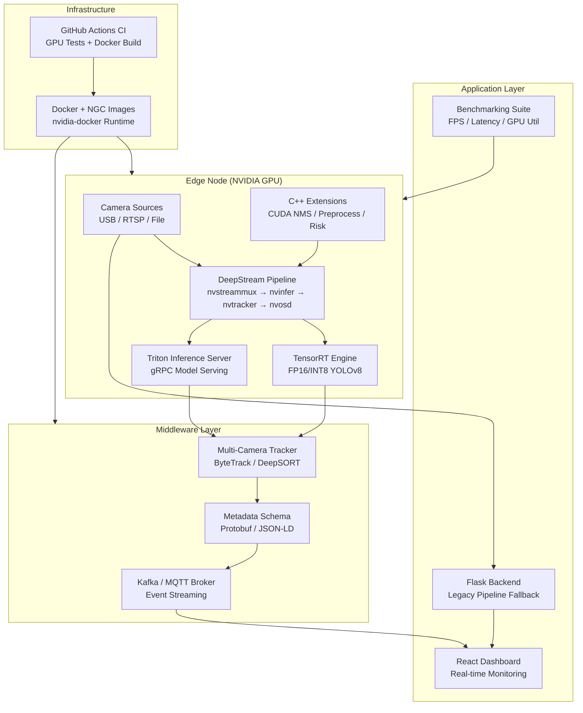
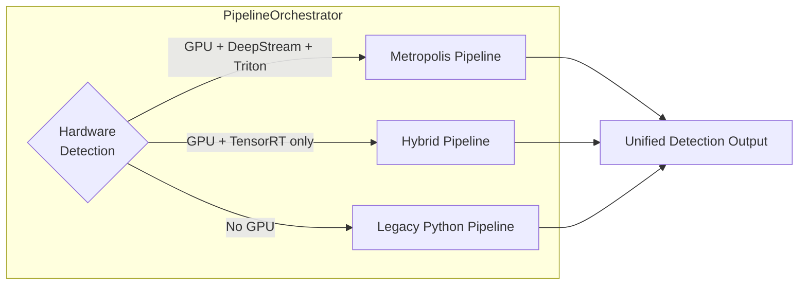

# AI Surveillance System

An advanced, edge-deployed AI surveillance and automated proctoring system powered by **NVIDIA Metropolis** architecture. It continuously monitors camera feeds to detect anomalies such as unauthorized cell phones, employing GPU-accelerated inference pipelines, multi-camera tracking, and real-time event streaming.

## Architecture



### Pipeline Selection

The system automatically selects the optimal pipeline based on available hardware:



| Pipeline | Requirements | Performance |
|----------|-------------|-------------|
| **Metropolis** | NVIDIA GPU + TensorRT + DeepStream + Triton | Highest throughput, lowest latency |
| **Hybrid** | NVIDIA GPU + TensorRT | Good throughput with local inference |
| **Legacy** | CPU only (PyTorch/Ultralytics) | Baseline, no GPU required |

## Quick Start

### Prerequisites

- Python 3.10+
- NVIDIA GPU with CUDA 12.x (for Metropolis/Hybrid pipelines)
- Docker with nvidia-container-toolkit (for containerized deployment)

### Option 1: One-Click Launch (Legacy Pipeline)

Double-click **`Start_All.bat`** to launch both the AI backend and React dashboard. The browser opens automatically at http://localhost:3000.

### Option 2: Docker Deployment (Full Metropolis Stack)

```bash
# Clone and enter the project
cd "AI Surveillance"

# Start the full stack (Triton + Kafka + App)
docker compose -f docker/docker-compose.yml up -d

# Verify services are healthy
docker compose -f docker/docker-compose.yml ps
```

### Option 3: Manual Setup

```bash
# Create conda environment
conda env create -f environment.yml
conda activate ai-surveillance

# Export TensorRT engine (requires NVIDIA GPU)
python -m metropolis.export_tensorrt --model models/yolov8m.pt --precision fp16

# Start the backend
python surveillance-app/backend/main.py

# Start the React dashboard (separate terminal)
cd surveillance-app && npm run dev
```

## Project Structure

```
AI Surveillance/
├── surveillance-app/backend/metropolis/   # Metropolis integration package
│   ├── config.py                          # MetropolisConfig dataclass
│   ├── orchestrator.py                    # Pipeline selection & orchestration
│   ├── export_tensorrt.py                 # TensorRT model export pipeline
│   ├── deepstream_pipeline.py            # DeepStream/GStreamer backend
│   ├── triton_client.py                  # Triton Inference Server client
│   ├── tracker.py                        # Multi-camera object tracking
│   ├── schema.py                         # Analytics metadata (Protobuf/JSON-LD)
│   ├── streaming.py                      # Kafka/MQTT event publishing
│   └── benchmark.py                      # Performance benchmarking suite
├── cpp_extensions/                        # C++/CUDA performance extensions
├── configs/                               # DeepStream & pipeline configs
├── docker/                                # Dockerfiles & compose files
├── models/                                # Triton model repository
├── benchmarks/                            # Benchmark results & runner
├── proto/                                 # Protobuf schema definitions
├── examples/                              # Example scripts
└── docs/                                  # Documentation
```

## Documentation

| Document | Description |
|----------|-------------|
| [Metropolis Setup Guide](docs/Metropolis_Setup.md) | Step-by-step installation and configuration |
| [API Reference](docs/API_Reference.md) | Python module interfaces and classes |
| [Benchmarks](docs/Benchmarks.md) | Performance methodology and results |
| [Architecture](docs/Architecture.md) | System design and data flow |
| [Processing Pipeline](docs/Processing_Pipeline.md) | Video processing details |

## Examples

```bash
# Export a TensorRT engine
python examples/export_model.py

# Run multi-camera tracking
python examples/track_objects.py

# Stream analytics events to Kafka
python examples/stream_events.py

# Run performance benchmarks
python examples/run_benchmark.py
```

## Running Tests

```bash
# Run all tests
pytest

# Run with coverage
pytest --cov=surveillance-app/backend/metropolis

# Run property-based tests
pytest -k "hypothesis" --hypothesis-seed=0
```

## License

This project is for educational and portfolio demonstration purposes.
